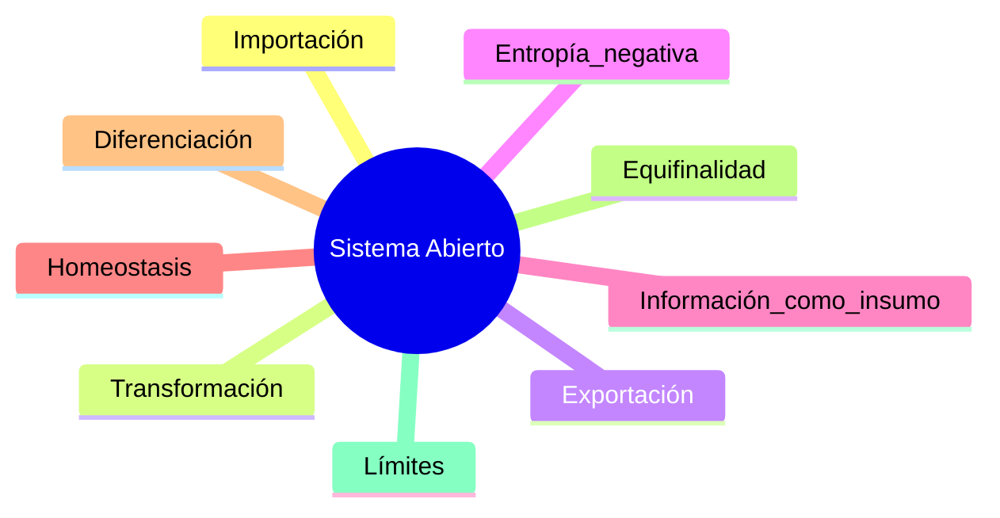
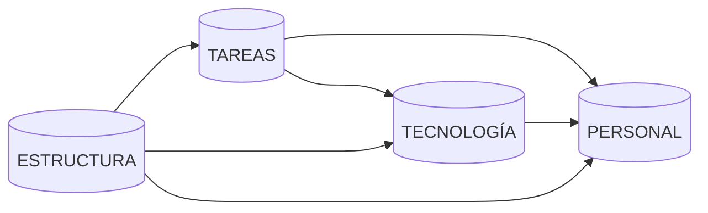
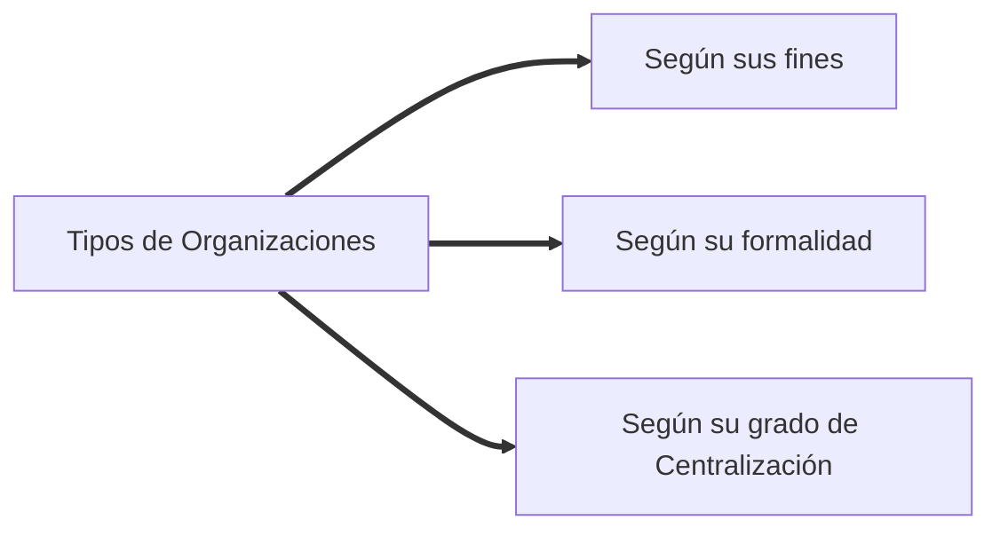

**Sistemas-y-Procesos-de-Negocio**
===

Unidades 1 a 3
---

<!-- 1 -->
<details>
<summary>
<h2>
1. Desarrolle los conceptos de Sistema, Subsistema y responda cuáles son los<br>
parámetros de sistema, grafique.
</h2>
</summary>

- **Definición Profe Andrea**:
>Un sistema es un conjunto organizado de elementos interrelacionados que
>interactúan entre sí, entre sus atributos y con su ambiente conformando una
>totalidad, persiguiendo un fin determinado, y teniendo una actuación conjunta
>superior a la suma de las actuaciones individuales de sus elementos. 

- El `sistema` es un conjunto de partes coordinadas y en interacción para
alacanzar un conjunto de objetivos.

- Un `sistema` es un grupo de partes y objetos que interactúan y que forman un
  todo o que se encuentran bajo la influencia de fuerzas en alguna relación
  definida.

- `Subsistema`:<br>
En general se puede afirmar que cada una de las partes que encierra un sistema
puede ser considerada como subsistema, es decir, un conjunto de partes e
interrelaciones que se encuentra estructuralmente y funcionalmente, dentro de un
sistema mayor,y que posee sus propias características. Asi los `subsistemas` son
sistemas más pequeños dentro de sistemas mayores.

- En general, las principales características de un sistema abierto, son su
  corriente de entrada, su proceso de conversión, su corriente de salida, y como
  elemento de control, la comunicación de retroalimentación.
   - La `corriente de entrada` transporta recursos materiales, financieros,
     humanos e información para el funcionamiento y mantención del sistema.

   - `Proceso de conversión`: Un sistema tiene un propósito o un objetivo. Todo
     sistema realiza alguna función, la engería que importan sirve para mover y
     hacer actuar sus mecanismos particulares con el fin de alcanzar los
     objetivos para los cuales fueron diseñados. Los sistemas convierten o
     transforma la energía que importan en otro tipo de energía, que representa
     la "producción" característica del sistema particular.

   - La `corriente de salida` equivale a la "exportación" que el sistema hace al
     medio. 
   
   - La `comunicación de retroalimentación` es la información que indica cómo lo
     está haciendo el sistema en la búsqueda de su objetivo, y que es
     introducido nuevamente al sistema con el fin de que se lleven a cabo las
     correcciones necesarias para lograr su objetivo (retroalimentación). Es un
     mecanismo de control que posee el sistema para asegurar el logro de su
     meta.

</details>

<!-- 2 -->
<details>
<summary>
<h2>
2. Qué es la TGS. Defina: Sistema, entropía, homeostasis y sinergía.
</h2>
</summary>

`Teoría General de Sistemas`:<br>
Es la teoría que busca los principios unificadores capaces de interconectar los
universos particulares de las ciencias, de forma que los progresos alcanzados en
una ciencia puedan beneficiar a las demás. Se trata de una teoría
interdisciplinaria.

<h2>Premisas básicas:</h2>

   1. Los sistemas existen dentro de sistemas, cada sistema se constituye en
      subsistemas y pertenece a un sistema mayor.

   2. Los sistemas son abiertos, cada sistema existe dentro de un medioambiente
      constituido por otros sistmas.

   3. Las funciones de un sistema dependen de su estructura, cada sistema tiene
      su finalidad y objetivo que establece su rol en el intercambio con los
      sistemas del medioambiente.

`Entropía` es la segunda ley de la termodinámica y se refiere a la pérdida de
energía de los sistemas cerrados. Significa la tendencia para la pérdida de
energía y el desvanecimiento del sistema, cuando no logra reponer sus pérdidas.

`Homeostasis` es la tendencia del sistema de mantener su equilibrio interno a
pesar de las perturbaciones ambientales. Lo mismo que autorregulación o estado
firme. Involucra equilibrio, permanencia y estabilidad.

`Sinergia` significa el efecto multiplicador cuando las partes del sistema
interectúan entre sí ayudándose mutuamente. El efecto sinergístico muestra que
el resultado del todo es mayor que la suma de las partes.

</details>

<!-- 3 -->
<details>
<summary>
<h2>
3. Grafique y explique: la organización como sistema abierto.
</h2>
</summary>

`Katz` y `Kahn` desarrollaron un modelo de organización, en el cual la 
organización presenta características típicas de un sistema abierto.

Las `organizaciones` constituyen una clase de sistemas sociales, los cuales
constituyen una clase de sistemas abiertos. Como tal, las organizaciones tienen
propiedades peculiares y comparten las propiedades de los sistemas abiertos,
como `entropía negativa`, `retroalimentación`, `homeostasis`, `diferenciación` y
`equifinalidad`. Los sistemas abiertos no están en reposo y ni siquiera son
estáticos, pues tienden a la elaboración y a la diferenciación.



</details>

<!-- 4 -->
<details>
<summary>
<h2>
4. Concepto de cibernética, cite algún ejemplo de sistema cibernético.
</h2>
</summary>

La `cibernética` es una teoría de los sistemas de control basada en la
comunicación (`transferencia de información`) entre sistema y medio circundante,
y dentro del sistema, y en el control (`retroalimentación`) del funcionamiento
del sistema en consideración al medio.

La `retroalimentación` en el sistema nervioso. El sistema nervioso funciona a
través de procesos circulares de ida y vuelta (retroalimentación) de
comunicación, que parten desde ese punto hasta los músculos y regresan por medio
de los órganos de los sentidos. La retroalimentación confirma si el objetivo se
cumplió, lo que es fundamental para el equilibrio del sistema.

</details>

<!-- 5 -->
<details>
<summary>
<h2>
5. ¿Qué es un modelo? ¿para que se utilizan? De ejemplos.
</h2>
</summary>

Un Modelo es una representación simplificada de la realidad.
En todo modelo se muestran las relaciones existentes entre las variables que son
relevantes y de interés para el análisis de sistemas.

El modelo sirve para: <br>
- Pensar y repensar lo hecho.
- Puede utilizarse como herramienta de predicción del comportamiento del
  sistema.
- Permite controlar mejor los procesos reales.
- El aprendizaje de los fenómenos involucrados en un sistema.

Ejemplos:
- El plano de un edificio
- Una fórmula matemática
- Una ley o estatuto
- Una estatua
- Un teorema
- Un programa de computación

</details>

<!-- 6 -->
<details>
<summary>
<h2>
6. Defina información. ¿Cuál es la diferencia con DATO?
</h2>
</summary>

- `El **DATO** es un registro o anotación de un evento u ocurrencia.` Un banco 
  de datos, por ejemplo, es un medio para acumular y almacenar conjuntos de 
  datos para que sean posteriormente combinados y procesados. Cuando un conjunto
  de datos posee un significado, tenemos una información.

- `La **INFORMACIÓN** es un conjunto de datos con un significado, o sea, que`
  `reduce la la incertidumbre o que aumenta el conocimiento de algo`. La
  información es un mensaje con significado en un determinado contexto,
  disponible para uso inmediato y que proporciona orientación a las acciones por
  el hecho de reducir el margen de incertidumbre con respecto a nuestras
  decisiones. 


</details>

<!-- 7 -->
<details>
<summary>
<h2>
7. Teoría de la comnicación. (Modelo de Shannon). Grafique el proceso de <br>
comunicación.
</h2>
</summary>

El sistema de comunicación tratado por la teoría de las informaciones consiste
en seis componentes: fuente, transmisor, canal, receptor, destino y ruido.

</details>

<!-- 8 -->
<details>
<summary>
<h2>
8. Modelo de Shannon. Grafique y describa sus componentes aplicando un caso <br>
concreto: Teléfono, PC, etc.
</h2>
</summary>
<h3>Sistemas de comunicaciones</h3>


|**COMPONENTES**|**SISTEMA TELEFÓNICO**|**PUERTA AUTOMÁTICA**|**PROGRAMA DE TV**|
|  :----  | :----: | :----: | :----: |
|**FUENTE**|Voz humana |Afluencia de personas interrumpiendo<br>un rayo de luz |Palcos y actores |
|**TRANSMISOR**|Aparto telefónico|Céluca fotoeléctrica y circuitos auxiliares|Cámara, transmisores y antenas|
|**CANAL**|Alambre conductor que conecta<br> un aparato a otro |Alambres conduciendo al solenoide<br> que mueve la puerta|Espacio libre|
|**RECEPTOR**|El otro aparato telefónico |Mecanismo selenoidal |Antena y aparto de TV|
|**DESTINO**|Oido humano|Puerta|Televidente|
|**RUIDO**|Estática, interferencia, línea<br> cruzada, ruidos|Mal funcionamiento de algunos<br> de los dispositivos|Estática interferencia, mal<br>funcionamiento de algunos<br>de los componentes|


</details>

<!-- 9 -->
<details>
<summary>
<h2>
9. Mencione y describa los componentes del Sistema de comunicación según <br>
Claude Shanon. Concepto de Redudancia.
</h2>
</summary>

El `Sistema de Comunicación` consiste en 6 componentes:<br>
1. La `fuente` significa persona, cosa o proceso que emite o provee los
   mensajes, por medio del sistema. 

2. El `transmisor` significa el proceso o equipo que opera el mensaje,
   transmitiéndolo de la fuente al canal. El transmisor codifica el mensaje
   provisto por la fuente para poder transmitirlo. En principio, todo transmisor
   es un codificador de mensajes.

3. El `canal` significa el equipo o espacio intermedio entre el transmisor y el
   receptor. 

4. El `receptor` significa el proceso o equipo que recibe el mensaje en el
   canal. El receptor decodifica el mensaje para colocarlo a disposición del
   destino. Todo receptor es un decodificador de mensajes.

5. El `destino` significa la persona, cosa o proceso al que se destina el
   mensaje en el punto final del sistema de comunicación.

6. El `ruido` significa la cantidad de perturbaciones indeseables que tienden a
   corromper y alterar, de forma imprevisible, los mensajes transmitidos. El
   concepto de ruido sirve para denotar las perturbaciones presentes en los
   diversos componentes del sistema, como es el caso de las perturbaciones
   provovadas por los defectos en el transmisor o receptor. 

La `redundancia` es la repetición del mensaje para que su recepción correcta se
garantice. La redundancia introduce en el sistema de comunicación una cierta
capacidad de eliminar el ruido y prevenir distorsiones y engaños en la recepción
del mensaje. Por eso, cuando se quiere entrar en una sala, se toca en la puerta
más de dos veces, o cuando se quiere comprobar el resultado de una operación
aritmética compleja, se vuelve a hacer.

</details>

<!-- 10 -->
<details>
<summary>
<h2>
10. Explique la organización como sistema abierto y los conceptos de <br>
Entropía y Sinergía.
</h2>
</summary>

El concepto de sistema abierto es perfectamente aplicable a la organización
empresarial. La organización es un sistema creado por el hombre y mantiene una
dinámica interacción cno su medio ambiente, sean clientes, proveedores, la
comptencia, entidades sindicales, órganos gubernamentales y otros agentes
externos. Influye sobre el medio ambiente y recibe influencia de él. Además, es
un sistema integrado por diversas partes o unidades relacionads entre si, que
trabajan en armonía unas con las otras, con la finalidad de alcanzar una seria
de objetivos, tanto de la organización como de sus participantes. 

El `Sistema Abierto` puede entenderse como un conjunto de partes en constante
interacción e interdependencia, constityendo un todo sinérgico ( el todo es
mayor que la suma de las partes), orientado hacia determinados propósitos
(conducta teleológica orientada hacia fines) y en permanente relación de
interdependencia con el ambiente (entendida como la doble capacidad de
influenciar en el medio externo y ser por él influenciado).

La `entropía` es la 2da Ley de la Termodinámica y se refiere a la pérdida de
energía de los sistemas cerrados. Significa la tendencia para la pérdida de
energía y el desvanecimiento del sistema, cuando no logra reponer sus pérdidas.

La `sinergía` significa el efecto multiplicador cuando las partes del sistema
interactúan entre sí ayudándose mutuamente. El efecto sinergístico muestra que
el resultado del todo es mayor que la suma de las partes.

</details>

<!-- 11 -->
<details>
<summary>
<h2>
11. ¿Qué es la informática? Relación con las IT.
</h2>
</summary>

La `informática` es una disciplina que se encarga del estudio, desarrollo y
aplicación de métodos y técnicas en el procesamiento automático de la
información. Su objetivo principal es el tratamiento y manipulación eficiente de
datos, permitiendo almacenar, recuperar, organizar, analizar y transmitir
información de manera rápida y precisa.

La `tecnología de la información` (TI), es el principal producto de la
cibernética, y representa la convergencia de la computadora con la televisión y
las telecomunicaciones. Ésta invade y transforma la vida de las organizaciones y
de las presonas provocando profundos cambios:

1. _Comprensión del espacio_:<br>

Introdujo el concepto de oficina virtual o no territorial. Edificios y oficinas
sufrieron una brutal reducción en tamaño. Los archivos electrónicos tenderán a
acabar con el papeleo y con la necesidad de muebles. Los centros de
procesamiento de datos (CPD) fueron reducidos a lo mínimo y descentralizados a
través de redes integradas de microcomputadoras en las organizaciones. Surgieron
las empresas virtuales conectadas electrónicamente.
La miniaturización, la portabilidad y la virtualidad se transformaron en la
nueva dimensión espacial provista por la TI.

2. _Comprensión del tiempo_:<br>

Las comunicaciones se hicieron móviles, flexibles, rápidas, directas y en tiempo
real, lo que permite más tiempo de dedicación al cliente. La inmediatez es la
nueva dimensión temporal provista por la TI.

3. _Conectividad_:<br>

Con la microcomputadora portátil, multimedia, trabajo en grupo, estaciones de
trabajo, surgió el teletrabajo en que las personas trabajan juntas, a pesar de
estar distantes físicamente. La teleconferencia y la telerreunión permiten mayor
contacto entre las personas sin la necesidad de desplazarse físicamente o viajar
para tener juntas o contactos personales.


</details>

<!-- 12 -->
<details>
<summary>
<h2>
12. ¿Qué es la informática? ¿Cómo incide en la Administración?
</h2>
</summary>

Es el área que cuida de la recolección, procesamiento, acumulación y
distribución de la información.

La `informática` es una disciplina que se encarga del estudio, desarrollo y
aplicación de métodos y técnicas en el procesamiento automático de la
información. Su objetivo principal es el tratamiento y manipulación eficiente de
datos, permitiendo almacenar, recuperar, organizar, analizar y transmitir
información de manera rápida y precisa.

Con la automatización provocada por la informática muchas tareas que cabían en
el cerebro humano, las comenzó a realizar la computadora. La computadora tiende
a sustituir al ser humano en una gama creciente de actividades con enorme
ventaja. Por medio de la informática, las organizaciones constituyen bancos de
datos, sistemas de información y redes de comunicaciones integradas.

Las principales consecuencias de la informática en la administración son:
- La automatización
- La TI
- Sistemas de Información
- Integración del negocio
- _e-businnes_

</details>

<!-- 13 -->
<details>
<summary>
<h2>
13. ¿Qué es un sistema de información? ¿Qué tipos de SI conoce?
</h2>
</summary>

Una organización recibe y utiliza información que le permite vivir y
sobrevivir en el ambiente que la rodea.
Las decisiones que toma se basan en la información disponible.
Por eso las organizaciones crearon los `sistemas de información` qué se encargan
de la búsqueda, colecta, almacenaje, clasificación y tratamiento de información
importante y relevante para su funcionamiento.

Un sistema de información constituye un sistema computacional capaz de
porporcionar información como materia prima para todas las decisiones que serán
tomadas por todos los participantes tomadores de decisión dentro de la
organización. Constituye una combinación de sistema de computación,
procedimientos y personas y tiene como base un banco de datos interconectados e
integrados.
Posee 3 componentes principales:
 - Los `datos`
 - El `sistema de procesamientos de datos`
 - Los `canales de comunicación`

Hay 4 tipos de estructuras de `Sistemas de Información`:
1. **Estructura centralizada**:<br>
La computadora central (_mainframe_) es el punto focal de todos los servicios de
procesamiento de datos. Todas las comunicaciones pasan a través del Centro de
Procesamiento de Datos (_CPD_) que controla todos los archivos.

2. **Estructura jerarquizada**:<br>
Distribuye la información de acuerdo a las necesidades específicas de cada nivel
organizacinal. Está involucrado el multiprocesamiento, porque los datos se
procesan según cada nivel jerárquico, independientemente de los demás.

3. **Estructura distribuida**:<br>
Varias computadoras separadas proveen datos a diferentes centros independientes,
aunque interactúan entre sí.

4. **Estructura descentralizada**:<br>
Es un reparto de los recursos computacionales. Cada división o región tiene sus
necesidades computacionales y, por lo tanto, su centro de procesamiento de datos
específico. Proporciona la mayor seguridad y rapidez en la provisión de
información, aunque es la más cara.

</details>

<!-- 14 -->
<details>
<summary>
<h2>
14. ¿Cuáles son los parámetros de un sistema?
</h2>
</summary>

1. **Entrada (Input):** Representa la primera interacción del sistema con el
   entorno, e incluye elementos como personas, energía, materia prima e
   información.

2. **Control (Feed-forward):** Antes de ingresar al sistema, se realiza un
   control para asegurar que la entrada cumpla con los requisitos establecidos,
   evitando ingresos no deseados o irrestrictos de elementos (por ejemplo,
   códigos de clientes o de artículos).

3. **Salidas (Resultados):** Son las consecuencias del proceso de transformación
   que ocurre dentro del sistema, y pueden incluir productos, beneficios,
   información, servicios, entre otros.

4. **Control de Salidas:** Se realiza una comparación de las salidas con
   objetivos o estándares previamente establecidos, verificando si se adecúan a
   los parámetros establecidos. En caso necesario, se ajustan mediante
   dispositivos controlados por sensores.

5. **Proceso (Throughput):** Es la actividad aplicada sobre las entradas para
   transformarlas, agregando valor y utilidad durante el proceso.

6. **Retroalimentación (Feedback):** Se utiliza para comparar las salidas con
   objetivos o estándares, proporcionando información sobre el funcionamiento
   del sistema y permitiendo ajustes para mantenerlo operando adecuadamente.

7. **Ambiente o Contexto:** Representa el conjunto de elementos exteriores que
   rodean, contienen e influyen en el sistema, teniendo un impacto significativo
   en su funcionamiento y desempeño.

</details>

<!-- 15 -->
<details>
<summary>
<h2>
15. Explique enfoque sistémico y enfoque analítico. ¿Se utilizan por <br>
separado? ¿Se complementan?
</h2>
</summary>

>**`El enfoque analítico y el enfoque sistémico son complementarios y no
>contrapuestos.`**

**`Enfoque analítico`:** 
- **Aisla:** Se concentra en los elementos individuales del sistema.
- **Considera las interacciones:** Examina la naturaleza de las interacciones
  entre los elementos.
- **Precisión de los detalles:** Se basa en la precisión de los detalles y las
  observaciones.
- **Modificación variable a la vez:** Modifica una variable a la vez para
  observar su impacto.
- **Fenómenos reversibles:** Los fenómenos considerados son reversibles y no
  toman en cuenta la duración.
- **Validación experimental:** La validación de los hechos se realiza mediante
  pruebas experimentales dentro de una teoría.
- **Modelos precisos y detallados:** Se utilizan modelos precisos y detallados,
  aunque pueden ser difíciles de aplicar en la acción.
- **Efectivo para interacciones lineales y débiles:** Funciona bien cuando las
  interacciones entre elementos son lineales y débiles.
- **Enseñanza por disciplinas:** Conduce a un enfoque de enseñanza basado en
  disciplinas.
- **Acción programada en detalles:** Proporciona un marco para la acción
  programada, considerando detalles específicos.
- **Conocimiento de detalles, objetivos mal definidos:** Se enfoca en detalles,
  pero puede tener objetivos poco definidos o ambiguos.

**`Enfoque sistémico`:**
- **Relaciona:** Se concentra en las interacciones entre los elementos del
  sistema.
- **Considera los efectos de las interacciones:** Examina cómo las interacciones
  afectan al sistema en su conjunto.
- **Basado en la percepción global:** Se basa en una visión global del sistema y
  su funcionamiento.
- **Modifica simultáneamente grupos de variables:** Realiza modificaciones en
  grupos de variables al mismo tiempo para analizar su impacto conjunto.
- **Integra la duración y la irreversibilidad:** Considera la duración y la
  irreversibilidad de los fenómenos en el análisis del sistema.
- **Validación comparativa:** La validación de los hechos se realiza comparando
  el funcionamiento del modelo con la realidad.
- **Modelos utilizables en la acción:** Los modelos pueden ser insuficientemente
  rigurosos para fundamentar conocimientos, pero son útiles para tomar
  decisiones y guiar la acción.
- **Efectivo para interacciones no lineales y fuertes:** Funciona bien cuando
  las interacciones entre elementos son no lineales y fuertes.
- **Enseñanza pluridisciplinaria:** Conduce a un enfoque de enseñanza que abarca
  varias disciplinas.
- **Acción por objetivos:** Promueve una acción enfocada en objetivos
  específicos.
- **Conocimiento de los objetivos, detalles borrosos:** Se centra en los
  objetivos, aunque los detalles pueden ser menos claros o definidos.  

</details>

<!-- 16 -->
<details>
<summary>
<h2>
16. La organización como sistema abierto. Cite los modelos dados.
</h2>
</summary>

>Un sistema es un conjunto organizado de elementos interrelacionados que
interactúan entre sí, entre sus atributos y con su ambiente conformando una
totalidad, persiguiendo un fin determinado, y teniendo una actuación conjunta
superior a la suma de las actuaciones individuales de sus elementos.

Las 5 caracteristicas del sistema abierto están desarolladas en el punto 18.

1. `Modelo de Schein`: <br>
Una organización es la coordinación racional de actividades de un grupo de
personas para procurar el logro de un objetivo o propósito explícito y común, a
través de la división del trabajo y funciones, y a través de una jerarquía de
autoridad y de responsabilidad.

```mermaid

```

2. `Modelo de Katz y Kahn`:<br>
Para Katz y Kahn, la organización como sistema abierto presenta las siguientes
características:
   1. `Importación (entrada)`: la organización recibe insumos del ambiente y
   necesita provisiones energéticas de otras instituciones, personas o del
   medio. Ninguna estructura social es autosuficiente.

   2. `Transformación (procesamiento)`: los sistemas abiertos transforman la
   energía disponible. La organización procesa y transforma insumos en productos
   acabados, mano de obra, servicios, etc.

   3. `Exportación (salidas)`: los sistemas abiertos exportan ciertos productos
   hacia el medio ambiente.

   4. `Los sistemas como ciclos que se repiten`: el funcionamiento de cualquier
   sistema consiste en ciclos repetitivos de
   importación-transformación-exportación. La importación y exportación son
   transacciones que envuelven al sistema en ciertos sectores de su ambiente
   inmediato, la transformación o procesamiento es un proceso contenido dentro
   del propio sistema.

   5. `Entropía negativa`: los sistemas abiertos necesitan moverse para detener el
   proceso entrópico y reabastecerse de energía manteniendo indefinidamente su
   estructura organizacional. A dicho proceso se le llama entropía negativa o
   Neguentropía.

   6. `Información como insumo, retroalimentación negativa y proceso de
   codificación`: los sistemas vivos reciben como insumos, materiales
   conteniendo energía que se transforman por el trabajo hecho. También reciben
   información, proporcionando señales sobre el ambiente. La entrada de
   información más simple es la retroalimentación negativa (negative feedback),
   que permite al sistema corregir sus desvíos de la línea correcta. Las partes
   del sistema envían información de cómo operan a un mecanismo central y
   mantiene así la dirección correcta. Si dicha retroalimentación negativa es
   interrumpida, el estado firme del sistema desaparece. El proceso de
   codificación permite al sistema reaccionar selectivamente respecto a las
   señales de información para las cuales esté programado. Es un sistema de
   selección de entradas a través del cual, los materiales son rechazados o
   aceptados e introducidos a su estructura.

   7. `Estado firme y homeostasis dinámica`: los sistemas abiertos se
   caracterizan por un estado firme, ya que existe un influjo continuo de
   energía del exterior y una exportación continua de los productos del sistema.
   La tendencia más simple del estado firme es la homeostasis, pero su principio
   básico es la preservación del carácter del sistema, o sea, un equilibrio
   casi-estacionario. Los sistemas reaccionan al cambio o lo anticipan por
   intermedio del crecimiento que asimila las nuevas entradas de energía en la
   naturaleza de sus estructuras. La homeostasis es un mecanismo regulador.

   8. `Diferenciación`: la organización, como todo sistema abierto, tiende a la
   diferenciación, o sea, a la multiplicación y elaboración de funciones, lo que
   le trae también multiplicación de papeles y diferenciación interna.

   9. `Equifinalidad`: los sistemas abiertos se caracterizan por el principio de
   equifinalidad, o sea, un sistema puede alcanzar, por una variedad de caminos,
   el mismo estado final, partiendo de diferentes condiciones iniciales.

   10. `Límites o fronteras`: como sistema abierto, la organización presenta
    límites o fronteras, esto es, barreras entre el ambiente y el sistema.
    Definen el campo de acción del sistema, así como su grado de apertura. 

```mermaid

```

3. `Modelo socio-técnico de Tavistock`:<br>
Propone que la organización es un sistema sociotécnico estructurado sobre dos
subsistemas:
   1.`Sistema Técnico:`<br>

 Está compuesto por la tecnología utilizada, el territorio en el que se
 desarrolla y el tiempo en el que opera. Es responsable de la eficiencia
 potencial del sistema, ya que abarca las tareas que serán desempeñadas, las
 instalaciones físicas, los equipos e instrumentos utilizados, las exigencias de
 la tarea, las utilidades y técnicas operacionales, el ambiente físico y la
 forma en cómo están acomodados. Además, engloba la manera en que se llevan a
 cabo las operaciones del sistema. En conjunto, estos elementos contribuyen a
 mejorar la eficiencia y el rendimiento del sistema técnico en el logro de sus
 objetivos.

   2. `Sistema Social:`<br>

 Es responsable de transformar la eficiencia potencial en eficiencia real. Está
 compuesto por las personas que forman parte del sistema, considerando tanto sus
 características físicas como psicológicas. Incluye también las relaciones
 sociales entre los individuos encargados de la ejecución de la tarea, así como
 las exigencias que surgen de la organización formal e informal en la situación
 de trabajo. En conjunto, estos elementos sociales juegan un papel fundamental
 en convertir el potencial de eficiencia del sistema técnico en resultados
 reales y efectivos, permitiendo una ejecución más efectiva de las tareas y
 alcanzar los objetivos establecidos.

```mermaid

```

</details>

<!-- 17 -->
<details>
<summary>
<h2>
17. De una definición de sistema. Grafique y ejemplifique.
</h2>
</summary>

>El sistema es un todo unitario organizado, compuesto por dos o más partes,
componentes o subsistemas interdependientes y delineado por límities
interdependientes de su suprasistema ambiente.

>Un sistema es un conjunto organizado de elementos interrelacionados que
interactúan entre sí, entre sus atributos y con su ambiente conformando una
totalidad, persiguiendo un fin determinado, y teniendo una actuación conjunta
superior a la suma de las actuaciones individuales de sus elementos.

```mermaid

```

Los sistemas abiertos son aquellos que interactúan activamente con su entorno y
reciben entradas y salidas constantemente. Aquí tienes algunos ejemplos de
sistemas abiertos:

El `cuerpo humano`: El cuerpo humano es un sistema abierto, ya que recibe
alimentos y oxígeno del entorno (entradas) para obtener energía y realizar
funciones vitales. Además, elimina desechos y CO2 al medio ambiente (salidas).

Una `planta`: Una planta es un sistema abierto, ya que absorbe agua, nutrientes
y luz solar del ambiente (entradas) para realizar la fotosíntesis y crecer. A su
vez, libera oxígeno y desecha productos de desecho al entorno (salidas).

Una `empresa`: Una empresa es un sistema abierto, ya que interactúa con
clientes, proveedores, competidores y otros actores del entorno para obtener
recursos (entradas) y producir bienes o servicios. Luego, vende sus productos al
mercado y genera ingresos (salidas).

Un `ecosistema`: Un ecosistema es un sistema abierto que incluye elementos
bióticos (seres vivos) y abióticos (clima, suelo, agua). Los organismos
interactúan con el ambiente, se alimentan, se reproducen y forman cadenas
tróficas (entradas y salidas).

Un `equipo de fútbol`: Un equipo de fútbol es un sistema abierto, ya que compite
con otros equipos (entorno), recibe apoyo y recursos de su club o patrocinadores
(entradas), y genera resultados y emociones en los aficionados (salidas).

Un `ecosistema urbano`: Una ciudad es un sistema abierto, donde las personas
interactúan entre sí, con empresas, instituciones y el medio ambiente. Reciben
recursos como alimentos y energía, y generan residuos y productos de consumo
(entradas y salidas).


</details>

<!-- 18 -->
<details>
<summary>
<h2>
18. Defina a la organización como sistema abierto y de ejemplos.
</h2>
</summary>

Un sistema abierto posee una permanente vinculación con su ambiente.

>La organización es influida por su medio ambiente desde el momento en que por
sus límites permeables ingresa una gran cantidad de insumos (energía,
materiales, personas). A su vez, por medio de sus salidas, influye en el
ambiente.

Como consecuencia de esa constante interacción con su medio ambiente, la
organización desarrolla cierta capacidad adaptativa con respecto a los cambios
que se producen en aquel, funcionando dentro de un estado estable o de
equilibrio dinámico. Al tiempo que prosigue con su continuo flujo de entrada,
transformación y flujo de salida. La retroalimentación es, por lo tanto,
fundamental para mantener al sistema dentro de ese equilibrio dinámico. Estar en
esas condiciones significa que el sistema vive absorbiendo elementos del
ambiente, pero funcionando dentro de los límites fijados por su estructura. Se
dice que el equilibrio es dinámico porque los cambios del ambiente modifican las
condiciones de equilibrio del sistema, llevándolo a una situación de un nuevo
equilibrio.

Las 6 características del sistema abierto:
1. El `comportamiento probabilístico (no determinista)`:<br>
ya que los cambios en las variables externas que forman parte del ambiente
pueden afectarlo. Esto significa que su comportamiento no es totalmente
previsible debido a la complejidad y a la presencia de variables que no pueden
ser controladas por el sistema.

2. La `interdependencia de las partes`:<br>
implica que el cambio en una de sus partes tiene un impacto en las demás. A
diferencia de los sistemas mecánicos, en los que las partes pueden reemplazarse
individualmente sin afectar al conjunto, en los sistemas abiertos, si una parte
es reemplazada, todas las demás se verán afectadas en mayor o menor medida.

3. La `homeostasis o equilibrio`:<br>
Los sistemas abiertos tienen la capacidad de mantener un equilibrio interno, lo
que significa que tienden a mantener su estado actual inalterado. Esta propiedad
implica que el sistema busca mantener su estabilidad interna en respuesta a los
cambios y perturbaciones externas. <br>
`Equifinalidad`: A pesar de los cambios en el
ambiente o dentro del sistema mismo, se logra alcanzar el mismo objetivo
utilizando diferentes medios o caminos. Es decir, existen múltiples formas o
estrategias para llegar al mismo resultado deseado, lo que otorga flexibilidad y
adaptabilidad al sistema en su búsqueda de cumplir sus metas.

4. La `frontera o límite`:<br>
Son las líneas que delimitan lo que constituye el Sistema y lo que pertenece a
su ambiente circundante. Establecer los límites de un sistema se basa en
considerar sus objetivos, funciones, entradas y salidas. Es necesario definir
claramente qué elementos son parte del sistema y cuáles se encuentran fuera de
él.

Para establecer los límites de un sistema, se deben responder preguntas como:
- ¿Qué elementos son necesarios para el funcionamiento y logro de los objetivos
  del sistema?
- ¿Qué entradas o recursos son requeridos para su operación?
- ¿Qué productos o resultados son generados como salidas del sistema?
- ¿Cuáles son los elementos o influencias externas que impactan en el
  funcionamiento del sistema?

Al definir los límites de un sistema de manera adecuada, se puede entender mejor
cómo interactúa con su ambiente, cómo se comporta y cómo logra sus metas de
manera eficiente.

5. La `morfogénesis`:<br>
 Es una propiedad cibernética que otorga al sistema la capacidad de modificar y
 transformar su propia estructura básica. Esto implica que el sistema puede
 adaptarse y cambiar en respuesta a las condiciones cambiantes del entorno y a
 las necesidades internas, permitiendo su evolución y desarrollo a lo largo del
 tiempo. La morfogénesis es una característica clave de los sistemas abiertos,
 ya que les permite mantener su equilibrio dinámico y lograr sus objetivos de
 manera flexible y eficiente.

6. La `resistencia`:<br>
Se refiere a la capacidad del sistema para superar o enfrentar los disturbios
provocados por fenómenos externos. Es el grado de defensa o vulnerabilidad que
presenta el sistema frente a las presiones ambientales externas. Un sistema con
alta resistencia será capaz de mantener su estabilidad y funcionamiento ante
cambios o perturbaciones en el entorno, mientras que un sistema con baja
resistencia será más susceptible a los impactos del ambiente y puede verse
afectado negativamente por ellos.

`Ejemplos:`
Los sistemas abiertos son aquellos que interactúan activamente con su entorno y
reciben entradas y salidas constantemente. Aquí tienes algunos ejemplos de
sistemas abiertos:

1. El cuerpo humano: El cuerpo humano es un sistema abierto, ya que recibe
   alimentos y oxígeno del entorno (entradas) para obtener energía y realizar
   funciones vitales. Además, elimina desechos y CO2 al medio ambiente
   (salidas).

2. Una planta: Una planta es un sistema abierto, ya que absorbe agua, nutrientes
   y luz solar del ambiente (entradas) para realizar la fotosíntesis y crecer. A
   su vez, libera oxígeno y desecha productos de desecho al entorno (salidas).

3. Una empresa: Una empresa es un sistema abierto, ya que interactúa con
   clientes, proveedores, competidores y otros actores del entorno para obtener
   recursos (entradas) y producir bienes o servicios. Luego, vende sus productos
   al mercado y genera ingresos (salidas).

4. Un ecosistema: Un ecosistema es un sistema abierto que incluye elementos
   bióticos (seres vivos) y abióticos (clima, suelo, agua). Los organismos
   interactúan con el ambiente, se alimentan, se reproducen y forman cadenas
   tróficas (entradas y salidas).

5. Un equipo de fútbol: Un equipo de fútbol es un sistema abierto, ya que
   compite con otros equipos (entorno), recibe apoyo y recursos de su club o
   patrocinadores (entradas), y genera resultados y emociones en los aficionados
   (salidas).

6. Un ecosistema urbano: Una ciudad es un sistema abierto, donde las personas
   interactúan entre sí, con empresas, instituciones y el medio ambiente.
   Reciben recursos como alimentos y energía, y generan residuos y productos de
   consumo (entradas y salidas).

</details>

<!-- 19 -->
<details>
<summary>
<h2>
19. Defina a la organización como sistema social. ¿Qué elementos la <br>
caracterizan? Ejemplifique.
</h2>
</summary>

La organización es un sistema social que tiene un propósito.

Una colectividad con una frontera relativamente identificable, un orden
normativo, niveles de autoridad, sistemas de comunicaciones y sistemas de
coordinación de sus miembros; esta colectividad existe de manera continua en un
ambiente y se involucra en actividades que se relacionan, por lo general, con un
conjunto de metas y estas actividades tienen resultados para los miembros de la
organización, la organización misma, y la sociedad

</details>

<!-- 20 -->
<details>
<summary>
<h2>
20. Desarrollo: Sistemas. Concepto. Tipos de Sistemas. Sus parámetros: <br>
Entradas, Salidas, procesamiento, retroalimentación y ambiente.
</h2>
</summary>

>Un sistema es un conjunto organizado de elementos interrelacionados que
interactúan entre sí, entre sus atributos y con su ambiente conformando una
totalidad, persiguiendo un fin determinado, y teniendo una actuación conjunta
superior a la suma de las actuaciones individuales de sus elementos.

Existen diferentes tipos de sistemas en diversos campos y disciplinas. Aquí hay
algunos ejemplos de sistemas clasificados según su naturaleza:

1. `Sistemas Naturales`: Son sistemas que existen en la naturaleza y se rigen
   por leyes científicas. Ejemplos incluyen sistemas climáticos, ecosistemas,
   cuerpos celestes, etc.

2. `Sistemas Sociales`: Son sistemas que involucran interacciones entre
   individuos y/o grupos sociales. Ejemplos incluyen sistemas políticos,
   sistemas económicos, comunidades, organizaciones sociales, etc.

3. `Sistemas Abiertos`: Son sistemas que interactúan con su entorno y reciben
   entrada y salida de información o energía para mantener su funcionamiento.
   Los seres vivos y muchas organizaciones son ejemplos de sistemas abiertos.

4. `Sistemas Cerrados`: Son sistemas que no intercambian información o energía
   con su entorno y se consideran aislados. En la práctica, es difícil encontrar
   sistemas completamente cerrados, pero a veces se utilizan como modelos
   teóricos.

5. `Sistemas Mecánicos`: Son sistemas físicos con componentes mecánicos y se
   rigen por principios de la mecánica clásica. Ejemplos incluyen relojes,
   motores, máquinas, etc.

6. `Sistemas Biológicos`: Son sistemas que involucran organismos vivos y sus
   interacciones. Ejemplos incluyen el cuerpo humano, ecosistemas, cadenas
   alimenticias, etc.

7. `Sistemas Informáticos`: Son sistemas basados en computadoras y software, que
   procesan información y datos. Ejemplos incluyen sistemas operativos,
   aplicaciones, redes informáticas, etc.

8. `Sistemas Complejos`: Son sistemas caracterizados por su alta interconexión y
   comportamiento emergente. Ejemplos incluyen el clima, el cerebro humano, la
   economía global, etc.

9. `Sistemas Adaptativos`: Son sistemas que tienen la capacidad de ajustarse y
   cambiar en respuesta a su entorno o nuevas condiciones. Ejemplos incluyen
   sistemas de inteligencia artificial, organismos vivos, etc.

10. `Sistemas Socio-técnicos`: Son sistemas que combinan elementos sociales y
    tecnológicos para lograr ciertos objetivos. Ejemplos incluyen sistemas de
    producción industrial, sistemas de transporte, etc.


Un sistema se describe a través de los siguiente parámetros:

- `Entrada (Input)`: Representa la primera interacción del sistema con su
  entorno, que puede incluir personas, energía, materia prima e información.
- `Control (Feed-forward)`: Se refiere al control previo de ingreso de elementos
  al sistema, asegurando que cumplan con los requisitos establecidos.
- `Salidas (Resultados)`: Son los elementos que salen del sistema como
  consecuencia de su proceso de transformación, como productos, beneficios,
  información o servicios.
- `Control de Salidas`: Implica la comparación de las salidas con los estándares
  u objetivos establecidos y la adecuación para mantener el funcionamiento del
  sistema según lo previsto.
- `Proceso (Throughput)`: Representa la actividad aplicada sobre las entradas
  para transformarlas y agregarles valor y utilidad.
- `Retroalimentación (Feedback)`: Consiste en comparar las salidas con objetivos
  o estándares previos para obtener información sobre el funcionamiento del
  sistema y ajustarlo en consecuencia.
- `Ambiente o Contexto`: Es el conjunto de elementos externos que rodean,
  contienen e influyen en el sistema.

Estos elementos y su interacción permiten entender y analizar el funcionamiento
y desempeño del sistema en su entorno.


</details>

<!-- 21 -->
<details>
<summary>
<h2>
21. Describa brevemente el sistema Socio-técnico y su relación con la <br>
eficiencia (Tavistock)...ver apunte.
</h2>
</summary>

El enfoque `sociotécnico` concibe a las organizaciones como una combinación de
tecnología y , al mismo tiempo, como un sistema social, desarrolándose entre los
sibsistemas una gran interacción mutua y recíproca..

El enfoque `socio-técnico` se basa en un modelo que describe a la organización
como constituida por 4 componentes interrelacionados:
Tareas - Personal - Tecnología - Estructura

Estos elementos se agrupan en dos subsistemas:
1. El **subsistema técnico**: que incluye los trabajos (tareas) que van a
   desempeñarse, la forma en que se dividieron esos trabajos y se buscó su
   coordinación (estructura), y los equipos, instalaciones, instrumentos, y el
   ambiente físico y su disposición (tecnología). 
   >Este subsistema es el
   responsable de la `eficiencia potencial` potencial de la organización.

2. El **subsistema social**: en el que se encuentran las personas, sus
   características físicas y psicológicas, las vinculaciones y relaciones tanto
   individuales como grupales, y las exigencias organizacionales en la
   realización de los trabajos. Este subsistema es el encargado de transformar
   la eficiencia potencial en eficiencia real.

</details>

<!-- 22 -->
<details>
<summary>
<h2>
22. Diga que entiende usted por una orgazación, dé una definición y ejemplos.
</h2>
</summary>

La `organización` es el proceso mediante el cual se articulan y disponen un
conjunto de medios y recursos, como personas, financieros, físicos e
información, con el fin de lograr metas concretas. Implica ensamblar y coordinar
estos recursos para crear una estructura que facilite la consecución de
objetivos y el máximo éxito. 

Una `organización` es un grupo humano de especialistas que trabajan juntos en
una tarea común y está diseñada deliberadamente para perdurar en el tiempo, con
una duración significativa en su existencia.

</details>

<!-- 23 -->
<details>
<summary>
<h2>
23. Defina la Organización como un sistema socio-técnico. De ejemplos.
</h2>
</summary>

La organización es un sistema socio-técnico interpersonal, creado
intencionalmente para lograr objetivos específicos en torno a un proyecto
concreto, satisfaciendo necesidades tanto de sus miembros como de una población
externa. Está en constante interacción con su entorno externo, colaborando o
compitiendo con diversas entidades presentes en ese contexto. (Aldo Schelmenson)

1. `Una fábrica`: Una fábrica es un ejemplo clásico de sistema socio-técnico,
   donde trabajadores y operarios interactúan con maquinaria y equipos para
   producir bienes.

2. `Un hospital`: En un hospital, médicos, enfermeros y personal de salud
   trabajan en conjunto con tecnología médica avanzada para proporcionar
   atención y servicios de salud a los pacientes.

3. `Una escuela`: En una escuela, docentes y estudiantes interactúan en un
   ambiente educativo que utiliza tecnologías como pizarras interactivas,
   computadoras y materiales de enseñanza para facilitar el proceso de
   aprendizaje.

4. `Una empresa de tecnología`: En este tipo de organizaciones, ingenieros y
   profesionales del área tecnológica colaboran para desarrollar y mejorar
   productos y servicios tecnológicos.

5. `Un centro de atención al cliente`: En estos centros, agentes de atención al
   cliente utilizan sistemas informáticos y herramientas de comunicación para
   resolver consultas y brindar asistencia a los clientes.

6. `Un centro de investigación científica`: En estos centros, científicos e
   investigadores trabajan con equipos y tecnología especializada para llevar a
   cabo investigaciones y experimentos.

7. `Un aeropuerto`: Un aeropuerto es un sistema socio-técnico donde el personal
   de seguridad, operadores de equipos de tierra, personal de atención al
   cliente y sistemas de control aéreo trabajan en conjunto para garantizar el
   funcionamiento seguro y eficiente del aeropuerto y sus operaciones de vuelo.

</details>

<!-- 24 -->
<details>
<summary>
<h2>
24. Considerando que la empresa es un sistema abierto. Explique los 
siguientes conceptos: Entorno o contexto (Clasificación y variables 
principales) y retroalimentación.
</h2>
</summary>

Ver 31

</details>

<!-- 25 -->
<details><summary>
<h2>
25. ¿Qué tipos de organización conoce? Grafique.
</h2>
</summary>


</details>

<!-- 26 -->
<details><summary>
<h2>
26. ¿Qué es una organización sin fines de lucro? Ejemplos.
</h2>
</summary>

Una `organización sin fines de lucro` es aquella cuyo principal objetivo no es
generar ganancias o utilidades para sus propietarios o miembros. Estas
organizaciones se caracterizan por tener una misión o función específica en la
sociedad y buscan cumplirla sin perseguir beneficios económicos para sí mismas.

Las organizaciones sin fines de lucro pueden operar en diversos ámbitos y
sectores, y suelen estar enfocadas en causas sociales, educativas, culturales,
medioambientales o de ayuda humanitaria. Su financiamiento proviene
principalmente de donaciones, subvenciones, aportes de socios o voluntarios, y
en algunos casos, también pueden generar ingresos a través de actividades
relacionadas con su misión.

1. Organizaciones no gubernamentales (ONG) que trabajan en temas como derechos
   humanos, medio ambiente, salud, educación, etc.

2. Fundaciones filantrópicas que apoyan causas sociales o realizan donaciones a
   instituciones benéficas.

3. Asociaciones y clubes cívicos o culturales que promueven actividades
   comunitarias y eventos sin ánimo de lucro.

4. Instituciones educativas y universidades sin fines de lucro.

5. Organizaciones religiosas y caritativas que brindan asistencia y servicios a
   comunidades necesitadas.

6. Hospitales y centros de salud sin fines de lucro que ofrecen atención médica
   a sectores vulnerables.

7. Museos y centros culturales que buscan preservar y difundir el patrimonio
   cultural sin buscar beneficios económicos directos.

</details>

<!-- 27 -->
<details><summary>
<h2>
27. ¿Qué es una organización formal? ¿Informal?
</h2>
</summary>

`Organización Formal:`

Es aquella que distribuye de manera precisa, explícita y
relativamente permanente las actividades, responsabilidades y autoridad entre
sus miembros. En este tipo de organización, las funciones y roles están
claramente definidos, y la jerarquía y estructura organizativa son formalmente
establecidas. Ejemplos de organizaciones formales son facultades, escuelas,
empresas y cualquier entidad con una estructura organizativa clara y
jerarquizada.

`Organización Informal:`

Es aquella que carece de una distribución explícita de
actividades, responsabilidades y autoridad entre sus miembros. En este tipo de
organización, las relaciones entre los integrantes son más dinámicas y no están
regidas por una estructura formal. Los grupos pueden formarse y disolverse de
manera continua, y el liderazgo puede surgir de forma más espontánea. Ejemplos
de organizaciones informales son grupos de amigos que se reúnen para organizar
eventos, vacaciones, cumpleaños, reuniones de estudio, entre otros.

</details>

<!-- 28 -->
<details><summary>
<h2>
28. ¿Qué es una organización con fines de lucro? Ejemplos.
</h2>
</summary>

Una organización con fines de lucro, también conocida como empresa, es aquella
cuyo principal objetivo es generar ganancias o utilidades para sus propietarios
y/o accionistas. Estas organizaciones operan con el propósito de obtener
beneficios económicos y maximizar el retorno de inversión para aquellos que
invierten en ellas.

En una empresa con fines de lucro, la toma de decisiones se orienta hacia la
rentabilidad y el crecimiento financiero. Sus actividades comerciales y
operativas están diseñadas para generar ingresos superiores a los costos y
gastos incurridos, lo que resulta en una utilidad neta que se distribuye entre
los propietarios o reinvierte en la empresa para su expansión y desarrollo.

Es importante mencionar que, aunque el lucro es el objetivo principal, las
organizaciones con fines de lucro también pueden tener otros objetivos
secundarios, como el crecimiento del mercado, la satisfacción del cliente o el
desarrollo de su personal, ya que estos factores pueden contribuir al logro de
sus metas financieras. Sin embargo, la generación de beneficios económicos sigue
siendo su propósito fundamental.

1. `Empresas comerciales`: Tiendas minoristas, supermercados, grandes almacenes,
   tiendas de electrónicos, etc.

2. `Empresas manufactureras`: Fábricas de automóviles, industrias alimentarias,
   empresas textiles, entre otras.

3. `Bancos y entidades financieras`: Instituciones bancarias, compañías de
   seguros, casas de bolsa, entre otros.

4. `Empresas de servicios`: Compañías de telecomunicaciones, proveedores de
   Internet, compañías de transporte, etc.

5. `Compañías tecnológicas`: Empresas qde software, empresas de hardware,
   compañías de tecnología de la información, entre otras.

6. `Cadena de restaurantes y cafeterías`: Franquicias de comida rápida,
   restaurantes de servicio completo, cafeterías, etc.

7. `Empresas de entretenimiento`: Cines, parques temáticos, compañías de medios
   y entretenimiento, etc.

8. `Empresas de consultoría y asesoría`: Firmas de consultoría de negocios,
   firmas de abogados, empresas de contabilidad, etc.

9. `Compañías farmacéuticas`: Empresas que fabrican y venden productos
   farmacéuticos y medicamentos.

10. `Empresas de transporte y logística`: Compañías de envío, empresas de
    logística, transporte de carga, entre otras.

Estos son solo algunos ejemplos, ya que hay una gran variedad de organizaciones
con fines de lucro en diferentes industrias y sectores económicos.

</details>

<!-- 29 -->
<details><summary>
<h2>
29. ¿Qué es una organización centralizada? Ejemplo.
</h2>
</summary>

Una `organización centralizada` es aquella en la cual la toma de decisiones y la
autoridad se concentran principalmente en la parte superior de la jerarquía, es
decir, en los niveles más altos de la estructura organizativa. En este tipo de
organización, se limita la delegación de autoridad hacia los niveles inferiores,
lo que significa que la mayor parte de las decisiones importantes son tomadas
por los altos directivos o líderes.

En una organización centralizada, la información y la toma de decisiones fluyen
de manera vertical, desde la cúpula de la organización hacia abajo, lo que puede
resultar en una estructura jerárquica rígida y una comunicación más lenta entre
los niveles. Las dependencias gubernamentales como los ejércitos, el correo y el
ministerio de economía son ejemplos típicos de organizaciones centralizadas,
donde la autoridad y la toma de decisiones están altamente concentradas en las
altas esferas del gobierno.

</details>

<!-- 30 -->
<details><summary>
<h2>
30. ¿Qué es el espacio organizacional?
</h2>
</summary>

El `espacio organizacional` se refiere a los distintos ámbitos físicos donde una
organización desarrolla sus actividades. Estos espacios pueden ser `internos`,
como las plantas industriales, oficinas o sucursales, y `externos`, como clubes
sociales o zonas cercanas a la organización. Es como un mapa o diseño social que
permite coordinar y relacionar todas las actividades tanto internas como
externas que generan la organización. En resumen, el espacio organizacional
abarca los entornos físicos en los cuales la organización opera y ejerce su
influencia.

</details>

<!-- 31 -->
<details><summary>
<h2>
31. Defina contexto organizacional. Ejemplos.
</h2>
</summary>

Una organización es un sistema abierto que se relaciona, interactúa, influye y
es influenciado por el `Contexto`.

**Contexto Social**:

Se refiere a la sociedad y comunidad en la que opera, incluyendo las actitudes,
valores, costumbres y deseos de las personas que la conforman. Puede
manifestarse a través de un marco jurídico o no, y comprende la interacción con
diversos grupos sociales y las influencias culturales presentes en su entorno.

**Contexto Político**:

Se manifiesta a través del marco jurídico y normativo de la sociedad. Este marco
está compuesto por leyes, decretos y reglamentaciones emitidos por las
autoridades pertinentes en diferentes jurisdicciones. Estas regulaciones
establecen las normas y pautas que deben seguir las organizaciones en su
funcionamiento y actividades dentro de la sociedad. El contexto político influye
en cómo las organizaciones operan y se adaptan a las exigencias y requisitos
establecidos por las autoridades gubernamentales.

**Contexto Cultural**:

Se refiere a los valores que una comunidad ha producido y comparte. Engloba todo
lo que sucede dentro de esa comunidad en términos de creencias, normas,
tradiciones, costumbres y expresiones artísticas. Los valores culturales
influyen en la forma en que las organizaciones operan y se relacionan con su
entorno, y también pueden afectar las expectativas y preferencias de los
clientes y empleados. Es importante que las organizaciones sean conscientes de
su contexto cultural para adaptarse de manera adecuada y respetuosa a las
diferencias culturales y aprovechar oportunidades que surjan de esta
interacción.

**Contexto Geográfico**:

Abarca desde una perspectiva macro, que incluye lo mundial, regional y nacional,
hasta una escala más micro, como la ciudad o el barrio en el que opera la
organización. Este contexto comprende factores geográficos, climáticos,
demográficos y culturales propios de cada ubicación, los cuales pueden influir
en las estrategias y operaciones de la organización. Es importante que las
organizaciones comprendan y consideren estas características geográficas para
adaptarse a las particularidades de cada entorno y maximizar su eficacia y
relevancia en su área de actuación.

</details>

<!-- 32 -->
<details><summary>
<h2>
32. ¿Qué marco normativo tienen las organizaciones?
</h2>
</summary>

El `marco normativo` de las organizaciones está compuesto por el conjunto de
leyes, decretos, reglamentaciones y otras normas jurídicas que regulan su
funcionamiento y actividades. Este marco normativo es establecido por las
autoridades pertinentes de diferentes jurisdicciones, como el gobierno nacional,
estatal o local, dependiendo del ámbito en el que la organización opere.

El `marco normativo` proporciona las pautas y los límites legales en los que las
organizaciones deben operar, asegurando un comportamiento ético y responsable,
así como también estableciendo mecanismos para proteger los derechos de los
trabajadores, clientes y otros grupos de interés.

Las organizaciones interactúan con su entorno social, cultural, político,
jurídico y económico. El marco jurídico normativo proviene de diferentes niveles
de gobierno (municipal, provincial y nacional) y regula la vida de las
organizaciones y personas. Esto incluye normas y leyes que establecen reglas de
conducta. Las organizaciones, como sistemas sociales, adquieren la
característica de persona jurídica, con derechos y obligaciones. El marco
jurídico normativo incluye la Constitución, leyes, decretos y reglamentaciones a
nivel nacional, provincial y municipal, así como las normas de organismos de
contralor y prácticas socialmente aceptadas por jurisprudencia o expertos.

</details>

<!-- 33 -->
<details><summary>
<h2>
33. ¿Qué se conoce como cultura organizacional? Ejemplos.
</h2>
</summary>

La `cultura organizacional` es un conjunto de valores, creencias, normas,
lenguajes, conocimientos, códigos de comportamiento y formas de actuar que son
conocidos y compartidos por los miembros de una organización. Esta cultura se
manifiesta en indicadores observables, como objetos, decoración, logotipos y
colores, así como en indicadores no observables, como ideologías, valores,
percepciones compartidas y acuerdos informales. La cultura organizacional abarca
prácticas, procesos y experiencias, y es influenciada tanto por los grupos como
por la propia organización, teniendo efecto en sus miembros y su identidad
corporativa. Es un elemento distintivo que identifica a la organización y guía
el comportamiento de sus miembros.

**Valores:** Los valores son principios y convicciones fundamentales que guían
el comportamiento y las decisiones de los miembros de una organización.
Representan las creencias compartidas sobre lo que es importante y correcto, y
tienen un impacto significativo en cómo se comporta y opera la organización.
Algunos ejemplos de valores son la responsabilidad, la honestidad, el respeto,
la ética y la excelencia.

**Visiones:** Las visiones son las ideas y aspiraciones que los líderes de la
organización tienen para el futuro de la empresa. Representan una imagen clara y
deseable del camino que la organización debe seguir y los logros que se esperan
alcanzar a largo plazo. Las visiones inspiran y motivan a los miembros de la
organización, brindando una dirección estratégica y un sentido de propósito
compartido.

**Impulsores:** Los impulsores son frases o conceptos que sintetizan la visión
de los líderes de la organización y que se adoptan como parte de la cultura
corporativa. Estas frases deben ser coherentes con la realidad de la empresa y
sus objetivos estratégicos. Los impulsores se utilizan para comunicar de manera
concisa y poderosa los valores y metas de la organización a sus empleados y
clientes.

**Creencias:** Las creencias son profesiones de fe y representan convicciones
arraigadas que trascienden la lógica racional. Estas creencias a menudo se basan
en historias o metáforas que definen la identidad y la imagen de la
organización. Por ejemplo, una empresa que rememora sus inicios con fotos
antiguas para enfatizar la honestidad y el compromiso con los clientes.

**Símbolos y Esloganes:** Los símbolos y esloganes refuerzan las creencias y
valores de la organización. Pueden ser logotipos, colores corporativos, nombres
de productos o servicios, entre otros. Estos elementos visuales y frases
distintivas representan la identidad de la organización y se utilizan para
generar reconocimiento y recordación en el público.

**Rituales y Ceremonias:** Los rituales y ceremonias son actos que se repiten de
manera consistente en la organización. Estas prácticas fomentan la cohesión y el
sentido de pertenencia entre los miembros, refuerzan los valores y celebran
logros importantes. Por ejemplo, la organización puede realizar ceremonias de
reconocimiento a empleados destacados o eventos anuales para promover la unión y
el sentido de comunidad dentro de la empresa.

</details>

<!-- 34 -->
<details><summary>
<h2>
34. De un ejemplo de planificación. Meta y Objetivo.
</h2>
</summary>

Ejemplo de Planificación:

`Meta`: Incrementar las ventas en un 20% en los próximos 12 meses.

`Objetivo`: Implementar estrategias de marketing digital para atraer a nuevos
clientes y fidelizar a los existentes.

En este ejemplo de planificación, la meta es aumentar las ventas en un 20% en el
plazo de 12 meses, lo que representa el resultado deseado que se quiere lograr.
Para alcanzar esta meta, el objetivo es utilizar estrategias de marketing
digital, que incluirían actividades como campañas en redes sociales, marketing
de contenidos, publicidad en línea, entre otras, con el fin de atraer a nuevos
clientes y mantener la lealtad de los clientes actuales.

Es importante mencionar que las metas son los resultados finales que se buscan
alcanzar, mientras que los objetivos son las acciones específicas que se deben
realizar para llegar a esa meta. En este caso, el objetivo de implementar
estrategias de marketing digital es el medio a través del cual se espera lograr
el incremento en las ventas. La planificación es fundamental para guiar las
acciones y esfuerzos hacia el logro de los objetivos y, finalmente, de las metas
establecidas.

</details>

<!-- 35 -->
<details><summary>
<h2>
35. Proceso de planeamiento: desarrolle el concepto de planeamiento <br>
estratégico y de planeamiento táctico. Diferencias.
</h2>
</summary>

Ver 37 y 38.

</details>

<!-- 36 -->
<details>
<summary>
<h2>
36. Desarrolle los siguientes conceptos: Departamentalización, delegación y <br>
organigrama.
</h2>
</summary>

La `departamentalización` es el proceso de agrupar tareas homogéneas dentro de
una organización según un criterio específico, creando departamentos
especializados. Facilita la coordinación, comunicación y control en una
organización en crecimiento, mejorando su eficiencia y efectividad en el
cumplimiento de objetivos.

Un `organigrama` es una representación gráfica de la estructura de una
organización, mostrando la jerarquía de departamentos y áreas funcionales, así
como las relaciones de autoridad y comunicación. Utiliza líneas y cuadros para
ilustrar niveles jerárquicos y cargos, proporcionando información sobre
responsabilidades y reportes. Es una herramienta valiosa para comunicar la
estructura organizativa y facilitar la comprensión de decisiones y flujo de
trabajo.

`Delegación` es transferir autoridad y responsabilidad a niveles inferiores en
la jerarquía organizativa. Empodera a los empleados, fomenta su desarrollo y
libera carga de trabajo a líderes. Requiere expectativas claras para un proceso
efectivo.

</details>

<!-- 37 -->
<details>
<summary>
<h2>
37. Explique brevemente el concepto de Planeamiento, describa el proceso de <br>
planeamiento y los niveles que le comprende.
</h2>
</summary>

El `planeamiento` es el proceso mediante el cual se establecen metas y se eligen
los medios para alcanzarlas. Es esencial para que los gerentes puedan organizar
adecuadamente a su personal y utilizar los recursos de la organización de manera
efectiva. Sin una planificación adecuada, es difícil saber hacia dónde dirigirse
y cómo lograr los objetivos deseados. La planificación proporciona una guía
clara y coherente para tomar decisiones y lograr el éxito en el cumplimiento de
las metas organizacionales.

Está compuesto por 3 niveles:
  - Planeamiento Estratégico.
  - Planeamiento Táctico.
  - Planeamiento Operativo.

</details>

<!-- 38 -->
<details>
<summary>
<h2>
38. Describa y diferencie: Planeamiento estratégico, táctico y operativo.
</h2>
</summary>

El planeamiento estratégico, táctico y operativo son tres niveles distintos de
planificación utilizados en una organización para alcanzar sus objetivos. Cada
uno se enfoca en diferentes horizontes temporales y niveles de detalle.

1. **Planeamiento Estratégico:**

    - `Horizonte temporal`: Largo plazo (generalmente de 3 a 5 años o más).

    - `Enfoque`: Se enfoca en establecer la dirección general y los objetivos
globales de la organización. Implica tomar decisiones de alto nivel que afectan
a toda la empresa y su posición competitiva en el mercado. 

    - `Alcance`: Cubre a toda la organización y abarca aspectos como la misión,
visión, valores, análisis del entorno, definición de objetivos estratégicos y
formulación de estrategias para lograrlos. 

    - `Responsabilidad`: La alta dirección y los principales ejecutivos de la
empresa son los responsables de la planificación estratégica.

2. **Planeamiento Táctico:**

    - `Horizonte temporal`: Mediano plazo (generalmente de 1 a 3 años). Enfoque:
Se enfoca en implementar las estrategias definidas en el planeamiento
estratégico. Implica traducir los objetivos estratégicos en planes y acciones
concretas para cada área o unidad funcional de la organización.

    - `Alcance`: Se centra en departamentos o áreas específicas de la
organización y busca optimizar sus recursos para contribuir al logro de los
objetivos estratégicos globales. 

    - `Responsabilidad`: Los gerentes de nivel medio y los líderes de unidades
funcionales son responsables de la planificación táctica y la ejecución de los
planes en sus áreas respectivas.

3. **Planeamiento Operativo:**

    - `Horizonte temporal`: Corto plazo (generalmente de 1 año o menos). 

    - `Enfoque`: Se concentra en la implementación detallada y la ejecución de
los planes tácticos. Implica definir actividades específicas, asignar recursos y
establecer fechas y metas alcanzables.

    - `Alcance`: Se refiere a las tareas diarias y rutinarias que deben llevarse
a cabo para alcanzar los objetivos tácticos y, por ende, los estratégicos.

    - `Responsabilidad`: Los supervisores y encargados de ejecutar las
actividades en el nivel operativo son responsables de la planificación operativa
y asegurar que se cumplan las tareas asignadas.

En resumen, el `planeamiento estratégico` establece la dirección general y los
objetivos de la organización, el `planeamiento táctico` traduce esos objetivos
en planes y acciones para áreas específicas, y el `planeamiento operativo` se
enfoca en la implementación detallada y ejecución de las tareas diarias para
alcanzar los objetivos tácticos y estratégicos. Cada nivel es esencial para
lograr el éxito y la efectividad de la organización en su conjunto.

</details>

<!-- 39 -->
<details>
<summary>
<h2>
39. Concepto de Misión, Visión y Valores.
</h2>
</summary>

La `misión` de una organización es su razón de ser y define su labor o actividad
en el mercado. También `identifica` el público al que va dirigido, destacando su
singularidad o factor diferencial. `Responde a preguntas` como qué hace la
organización, cuál es su negocio, a qué se dedica, quiénes son su público
objetivo, cuál es su ventaja competitiva y cómo se diferencia de sus
competidores. Es una `declaración fundamental` que expresa el carácter, deberes
y responsabilidades funcionales de la organización. En una estructura
organizativa funcional, la misión y las funciones representan el objetivo
institucional y los sub-objetivos, respectivamente.

La `visión` de una organización define las metas que se pretenden alcanzar en el
futuro. Estas metas deben ser realistas y alcanzables, ya que la visión tiene un
carácter inspirador y motivador. Responde a preguntas como qué se quiere lograr,
dónde se quiere estar en el futuro, para quién se trabajará y si se ampliará la
zona de actuación. Es una declaración que guía el rumbo y orienta el esfuerzo
hacia una aspiración clara y deseable para la organización.

Los `valores` son principios éticos que fundamentan la cultura de una empresa y
guían su comportamiento. Representan la personalidad de la organización y deben
reflejar la realidad en lugar de ser meras expresiones de deseos de los líderes.
Es recomendable formular un número limitado de valores, generalmente de 6 a 7,
para mantener la credibilidad. Para definir los valores corporativos, es
importante responder a preguntas como "¿Cómo somos?" y "¿En qué creemos?" Esto
ayuda a establecer las pautas fundamentales que guiarán las acciones y
decisiones de la empresa.

</details>

<!-- 40 -->
<details>
<summary>
<h2>
40. ¿Qué se conoce como cultura organizacional? Ejemplifique.
</h2>
</summary>

**L**a cultura organizacional se refiere a la forma de relacionarse entre <br>
sí que presenta una organización. Es el conjunto de valores, creencias,<br>
normas, comportamientos y actitudes compartidas que la misma posee.  

**P**or ejemplo, si los gerentes de una empresa han creado una clima de <br>
confianza y respeto y cuentan con un modelo participativo de toma de <br>
decisiones, habrá mucha comunicación hacia arriba ya que los empleados <br>
proveen sus ideas para las decisiones.  

**E**n cambio, en un ambiente más estructurado y autoritario, la  <br>
comunicación hacia también se da, pero es limitada.


</details>

<!-- 41 -->
<details>
<summary>
<h2>41. ¿Cuál es el concepto de poder? ¿Qué tipos de poder conoce?</h2>
</summary>

Es la capcidad para ejercer influencia en los demás.<br>
Las 5 categorías de poder fueron propuestas por los psicólogos John French <br>
y Bertram Raven en 1959:

`1.` **Poder legítimo:** El poder legitimado se define como la autoridad <br>
que ostenta un individuo o un grupo debido a su posición jerárquica y<br>
responsabilidades dentro de una organización o sociedad. Este poder confiere<br>
al titular una autoridad formal y delegada, como en el caso del CEO (Chief<br>
Executive Officer) de una compañía.

`2.` **Poder de referencia:** El poder de referencia se define como la <br>
capacidad de ciertos individuos para persuadir o influir en otros, basándose<br>
en su carisma y habilidades interpersonales. En este caso, la persona que <br>
está bajo la influencia del poder toma al portador del poder como un modelo<br>
a seguir e intenta actuar de manera similar. Este tipo de poder puede<br>
manifestarse en diversas situaciones, incluso en la relación con un CEO<br>
(Chief Executive Officer) u otra figura de liderazgo.


`3.` **Poder experto:** El poder experto es aquel que se deriva de las<br>
habilidades o pericia que poseen ciertas personas, y de la relevancia de<br>
esas habilidades para las necesidades de la organización o sociedad en<br>
cuestión. A diferencia de otras categorías de poder, este tipo de<br>
influencia es generalmente muy específico y está limitado al área en la<br>
cual el experto está cualificado. Es importante señalar que una persona con<br>
poder experto puede ser promovida y también poseer poder legítimo, ya que<br>
su conocimiento especializado y habilidades valiosas pueden respaldar su<br>
autoridad formal en una posición de liderazgo.

`4.` **Poder de recompensa:** El poder de recompensa se fundamenta en la<br>
capacidad del líder para otorgar beneficios materiales a los demás. Esto<br>
implica la habilidad del individuo para ofrecer diversas recompensas, como<br>
tiempo libre, regalos, promociones, aumentos salariales o incremento de<br>
responsabilidades. Cuando este poder es utilizado de manera efectiva, puede<br>
motivar a los empleados, incentivándolos a mejorar su rendimiento y<br>
compromiso.<br>  
Sin embargo, es importante tener en cuenta que si el poder de recompensa se<br>
aplica a través de favoritismos o de manera injusta, puede tener un efecto<br>
negativo en la moral de los empleados y disminuir su productividad. Por <br>
tanto, es esencial que el uso de este poder sea equitativo y transparente <br>
para mantener un ambiente laboral saludable y motivador.<br>  

`5.` **Poder de coacción:** El poder de coacción se fundamenta en la <br>
capacidad de imponer castigos por parte de quien lo posee. Es similar a la <br>
capacidad de negar o quitar recompensas, y su origen radica en el deseo de<br>
aquellos que están sujetos a este poder de obtener recompensas valiosas, <br>
pero bajo la forma negativa del temor a perderlas. Es precisamente este
miedo<br> lo que asegura, en última instancia, la eficacia de este tipo de
poder.<br>  
Sin embargo, el poder de coacción tiende a ser la forma de poder menos <br>
efectiva debido a que puede generar resentimiento y resistencia por parte de<br>
quienes están sometidos a él. El uso excesivo de castigos y amenazas puede <br>
crear un ambiente de trabajo hostil y afectar negativamente la motivación<br>
y el rendimiento de los empleados. Por tanto, es importante que los líderes <br>
utilicen este tipo de poder con cautela y consideren en su lugar enfoques <br>
más constructivos para motivar y dirigir a su equipo.
</details>

<!-- 42 -->
<details>
<summary>
<h2>42. ¿Cuál es el concepto de autoridad? ¿Qué tipos conoce?</h2>
</summary>

La `autoridad` es una forma de poder.<br>
Es la postesdad o facultad que tiene una persona sobre otra que le está <br>
subordinada. Es la persona revestida de algún poder o mando.<br>

__`Autoridad Formal`__:<br>
- Es un tipo de poder que se asocia con la estructura y la administración de<br>
las organizaciones.
- Se basa en el reconocimiento de que el intento de los gerentes de influir <br>
en los demás es legítimo.
- Es un derecho que emana del puesto formal de la organización.
- La autoridad formal proviene del poder.<br>

Según la `posición clásica`, la autoridad reside en el nivel más alto, y<br>
desciende de nivel en nivel.<br>

Ejemplo: 
  - Dios
    - Estado
      - (Rey, Dictador, Presidente electo)
        
Según la `posición de la aceptación`, la base de la autoridad está en el<br>
`influido`  y no en el `influyente`, tiene más que ver con la obediencia,<br>
porque el receptor `decide` <br>
No quiere decir que la insubordinación y el caos son la norma de las<br>
organizaciones.

__`Autoridad Moral`__: <br>
- Proviene de la lealtad de los demás hacia su líder, inspirada por su<br>
integridad y congruencia.


__`Autoridad Lineal`__:<br>
- La "Autoridad Lineal" implica que los responsables tienen la directa<br>
responsabilidad de alcanzar las metas y objetivos de la organización,<br>
siguiendo la cadena de mando.
- Este tipo de autoridad se fundamenta en el poder legítimo.<br>
- Se establece una relación entre un superior y sus subordinados, con una <br>
línea de mando claramente definida.
- Las comunicaciones en este sistema suelen ser rígidas y unidireccionales,<br>
fluyendo de manera descendente desde los superiores hacia los subordinados.<br>

__`de Staff`__:<br>
- El grupo de personas que ofrece asesoría y servicios a los gerentes de <br>
línea es conocido como personal de apoyo. 
- Su función es brindar recomendaciones y asesoramiento, sin tener la <br>
autoridad para emitir órdenes a niveles inferiores o al ejecutivo al que <br>
están asesorando.<br>

__`Funcional`__:<br>
- Los miembros del Staff carecen de autoridad formal independiente.
- No obstante, pueden tener autoridad formal dentro de los límites establecidos
con los miembros de la línea.
- Esta autoridad formal se traduce en el derecho delegado a un individuo o
departamento para controlar procesos, prácticas, políticas específicas u otros
asuntos relacionados con las actividades realizadas por el personal de otros
departamentos.

</details>

<!-- 43 -->
<details>
<summary>
<h2>43. Diferencia poder de autoridad y diga que significa delegar.</h2>
</summary>

La `autoridad` es una forma de poder que una persona tiene sobre otra que está
subordinada a ella. Enfoques más recientes han llevado a hablar de "aceptación
de la autoridad", lo que implica que la influencia se obtiene no solo a través
del poder formal, sino también por la aceptación y reconocimiento de la
competencia y habilidades de quien ejerce la influencia.

`Delegar` es el acto de transferir autoridad y responsabilidad a otros miembros
de una organización o equipo para que puedan llevar a cabo tareas específicas o
tomar decisiones relacionadas con su trabajo. Esto implica ceder el control y
permitir que los empleados asuman la responsabilidad de sus funciones, lo que
puede conducir a una mayor autonomía, empoderamiento y desarrollo de habilidades
en los empleados. El liderazgo basado en la delegación fomenta la participación
y el trabajo en equipo, lo que puede cambiar los estilos de liderazgo y las
relaciones de poder dentro de una organización.

</details>

<!-- 44 -->
<details>
<summary>
<h2>
44. Concepto de liderazgo, qué es un líder y que tipos de liderazgo conoce.
</h2>
</summary>

>La capacidad de influir en un grupo para que logren sus metas trazadas

>Liderazgo gerencial, es un proceso de interacción con los seguidores, ellos
reciben orientación, consejo, guía e influencia.

El liderazgo es una forma de ejercer influencia.

El liderazgo consiste en dirigir y controlar a las personas dentro de una
organización. Los líderes motivan a sus subordinados, guían sus actividades,
seleccionan canales de comunicación efectivos y resuelven conflictos para lograr
los objetivos del grupo de manera eficiente y efectiva.

**Liderazgo orientado a las tareas**: Los líderes con este enfoque se centran
principalmente en supervisar y coordinar las tareas y actividades del equipo. Su
objetivo principal es asegurarse de que el trabajo se realice de manera efectiva
y satisfactoria. Priorizan el cumplimiento de objetivos y metas, enfocándose más
en los resultados y la eficiencia que en las necesidades individuales de los
empleados. Aunque la satisfacción del empleado no es ignorada, el énfasis está
en completar el trabajo y alcanzar los resultados deseados.

**Liderazgo orientado a los empleados**: Los líderes con este estilo ponen un
mayor énfasis en la motivación y el bienestar de los empleados. Buscan
establecer relaciones de confianza y respeto con su equipo, fomentando un
ambiente positivo y colaborativo. Estos líderes se preocupan por el desarrollo
personal y profesional de sus empleados, y buscan satisfacer sus necesidades y
expectativas. Además, permiten que los empleados participen en la toma de
decisiones, lo que puede aumentar su compromiso y sentido de pertenencia.

</details>
